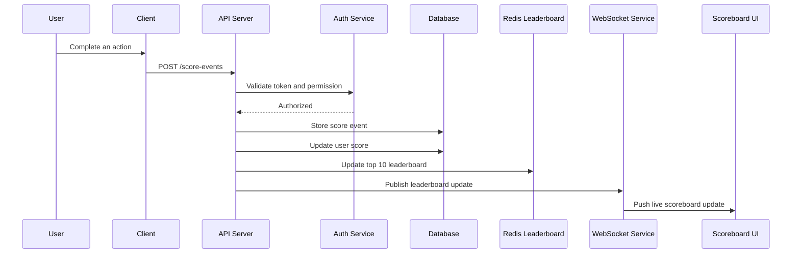

# Problem 6 - Architecture: Live Scoreboard API

## 1. Overview

This module provides an API service for updating user scores and showing a live top-10 scoreboard.

When a user completes an authorized action, the client sends a request to the backend API. The backend validates the request, updates the user's score, recalculates the leaderboard, and sends live updates to connected clients.

## 2. Main Requirements

* Show top 10 users with the highest scores.
* Update the scoreboard in real time.
* Increase a user's score after a completed action.
* Prevent unauthorized or malicious score updates.
* Provide a reliable and scalable backend design.

## 3. Proposed Architecture



## 4. API Specification

### 4.1 Update Score

```http
POST /score-events
```

Request body:

```json
{
  "userId": "123",
  "actionId": "daily_login",
  "scoreDelta": 10,
  "idempotencyKey": "unique-event-key-001"
}
```

Response:

```json
{
  "success": true,
  "userId": "123",
  "newScore": 120
}
```

### Validation Rules

* User must be authenticated.
* User must be allowed to perform the action.
* `scoreDelta` must be generated or verified by the backend, not trusted directly from the client.
* `idempotencyKey` must be unique to prevent duplicate score updates.
* Invalid or repeated requests must be rejected.

## 5. Data Model

### users

| Field      | Type     | Description         |
| ---------- | -------- | ------------------- |
| id         | string   | User ID             |
| name       | string   | Display name        |
| score      | number   | Current total score |
| created_at | datetime | Created time        |
| updated_at | datetime | Updated time        |

### score_events

| Field           | Type     | Description        |
| --------------- | -------- | ------------------ |
| id              | string   | Event ID           |
| user_id         | string   | User ID            |
| action_id       | string   | Action type        |
| score_delta     | number   | Score added        |
| idempotency_key | string   | Unique request key |
| created_at      | datetime | Created time       |

## 6. Security Considerations

The client should not be trusted to directly control score values.

Recommended protections:

* Use JWT or session authentication.
* Validate every request on the backend.
* Use server-side rules to decide score values.
* Use idempotency keys to prevent replay or duplicate requests.
* Apply rate limiting per user/IP.
* Log suspicious requests.
* Use database transactions when updating score and inserting score event.
* Do not expose internal scoring rules unnecessarily.

## 7. Live Scoreboard Update

For live updates, use WebSocket or Server-Sent Events.

Flow:

1. User completes an action.
2. API validates and updates the score.
3. API recalculates top 10 users.
4. API publishes the new leaderboard.
5. Connected clients receive the update immediately.

## 8. Performance Considerations

For small systems, the top 10 scoreboard can be queried directly from the database:

```sql
SELECT id, name, score
FROM users
ORDER BY score DESC
LIMIT 10;
```

For larger systems, Redis Sorted Set is recommended:

* Key: `leaderboard`
* Member: `userId`
* Score: user score

This allows fast leaderboard retrieval.

## 9. Failure Handling

* If database update fails, return an error and do not publish a leaderboard update.
* If WebSocket publish fails, the score update should still remain saved.
* Clients can reload the leaderboard using `GET /leaderboard`.

## 10. Additional Improvements

* Add audit logs for all score changes.
* Add admin tools to review suspicious score events.
* Add monitoring for abnormal score increases.
* Add automated tests for score update rules.
* Add background jobs if score calculation becomes complex.
* Add leaderboard pagination if more than top 10 is needed later.
